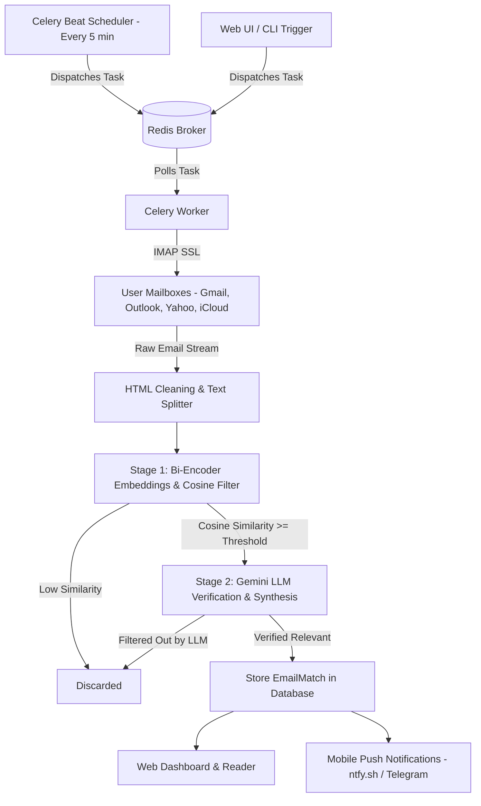

# Notifier

[](https://www.python.org/)
[](https://www.djangoproject.com/)
[](https://docs.celeryq.dev/)
[](https://redis.io/)
[](https://aistudio.google.com/)
[](https://render.com/)

> **AI-Powered Inbox Intelligence, Background Sync & Multi-Stage Email Filtering Pipeline**

Notifier is an intelligent email ingestion and relevance engine that continuously monitors incoming emails across multiple IMAP providers (Gmail, Outlook, Yahoo, iCloud, Custom IMAP), filters high-signal messages matching user-defined interest topics, generates structured AI summaries using Google Gemini, and delivers instant push notifications directly to your mobile device.

---

## Architecture: Multi-Stage Pipeline & Background Processing

Notifier combines asynchronous worker queues with a two-stage cascaded filtering funnel to balance low latency, minimal compute cost, and high semantic precision:



### Pipeline Details:
1. **Stage 1 — Fast Cosine Similarity Filter (Bi-Encoder)**:
   - Splits incoming email bodies using `RecursiveCharacterTextSplitter`.
   - Generates vector embeddings via `all-MiniLM-L6-v2`.
   - Compares vector embeddings against user topics to discard irrelevant mail at near-zero cost.
2. **Stage 2 — LLM Semantic Verification & Structured Synthesis**:
   - Forwards candidate chunks to Google Gemini (`gemini-2.5-flash`).
   - Verifies whether the email genuinely matches the topic context.
   - Extracts structured key takeaways and action items.
3. **Stage 3 — Real-Time Mobile Dispatch**:
   - Immediately dispatches a push notification to your phone via `ntfy.sh` or `Telegram` with the platform tag, subject, sender, and AI summary.

---

## Core Features

- **Asynchronous Task Queue**: Background processing powered by Celery and Redis to prevent blocking web requests.
- **Automated 5-Minute Polling**: Celery Beat scheduler continuously synchronizes connected mailboxes without manual intervention.
- **Instant Mobile Push Notifications**: Zero-setup alerts on your phone lock screen via `ntfy.sh` or Telegram with platform tags (`[Gmail]`, `[Outlook]`, etc.).
- **Bring Your Own Key (BYOK)**: User-provided Google Gemini API keys stored with AES/Fernet encryption.
- **Platform Agnostic IMAP**: Connect any email provider (Gmail, Outlook, Yahoo, Apple iCloud, or custom corporate IMAP servers).
- **Sandboxed Security**: Sandboxed rendering for HTML emails preventing script execution or style leakage.
- **Production Ready**: Pre-configured with Gunicorn, WhiteNoise static files serving, PostgreSQL database support, and Render Blueprints.

---

## Security & Privacy Architecture

- **BYOK Gemini Architecture**: No static API keys stored in global configuration. Users configure their own Google AI Studio API key via the Profile dashboard.
- **Encrypted Storage at Rest**:
  - IMAP passwords and Gemini API keys are encrypted at rest using `Fernet` (AES-128-CBC + HMAC-SHA256) with a 256-bit key derived via SHA-256.
  - Plaintext credentials exist strictly in memory during active IMAP connections and AI calls.
- **XSS & Isolation**:
  - HTML emails are rendered in an isolated `<iframe>` with strict sandbox restrictions (`allow-same-origin allow-popups`).
- **User Scoping**:
  - All database queries, mailboxes, topics, and notifications are scoped strictly to `request.user`.

---

## Getting Started: Setup & Onboarding Guide

### Part 1: Developer / Local Server Setup
Follow these steps to run the server on your computer:

#### 1. Clone Repository & Setup Environment
```bash
git clone https://github.com/AniceKV/Notifier.git
cd Notifier

# Create and activate virtual environment
python -m venv .venv

# On Windows:
.venv\Scripts\activate
# On macOS/Linux:
source .venv/bin/activate

# Install dependencies
pip install -r requirements.txt
```

#### 2. Configure Environment Variables
Copy `.env.example` to `.env`:
```bash
cp .env.example .env
```

Edit `.env` to configure your settings:
```env
SECRET_KEY="your-cryptographically-secure-random-secret-key"
DJANGO_DEBUG="True"
ALLOWED_HOSTS="127.0.0.1,localhost"
TIME_ZONE="Asia/Kolkata"

# Mobile push notification topic (subscribe to this in the free ntfy mobile app)
NTFY_TOPIC="Notifier_for_anish"

# Celery Redis broker URL (defaults to localhost:6379)
CELERY_BROKER_URL="redis://localhost:6379/0"
CELERY_RESULT_BACKEND="redis://localhost:6379/0"
```

#### 3. Apply Database Migrations & Create Admin
```bash
cd djangoproj
python manage.py migrate
python manage.py createsuperuser
```

#### 4. Launch the Server Suite
- **Option A (1-Click Launch on Windows)**:
  Run `start.bat` from the root directory. It automatically starts Redis in WSL, launches Celery Worker, Celery Beat, and the Django web server in coordinated windows.
- **Option B (Manual Launch)**:
  Start Redis on port 6379, then open three terminals inside `djangoproj/`:
  - Terminal 1: `python manage.py runserver`
  - Terminal 2: `celery -A djangoproj worker -l info --pool=solo`
  - Terminal 3: `celery -A djangoproj beat -l info`

---

### Part 2: Web App User Onboarding
Once the server is running, any new user completes these 4 steps in the browser to start receiving AI summaries:

#### Step 1: Create an Account & Sign In
- Navigate to `http://127.0.0.1:8000/` (or your live deployed URL).
- Register a new user account and log in.

#### Step 2: Add Google Gemini API Key (BYOK)
- Go to **Profile & Settings** (`/profile/`).
- Under **Gemini AI Configuration**, paste your free API key from [Google AI Studio](https://aistudio.google.com/app/apikey).
- Keys are encrypted with AES/Fernet encryption upon saving.

#### Step 3: Connect an Email Mailbox
- In **Connected Mailboxes**, click **Connect Mailbox**:
  - **Platform**: Select Gmail, Outlook, Yahoo, iCloud, or Custom IMAP.
  - **Email Address**: Your email address (e.g. `you@gmail.com`).
  - **App Password**: Your 16-character IMAP App Password (for Gmail, generate one in Google Account -> Security -> 2-Step Verification -> App Passwords).

#### Step 4: Define Interest Topics to Track
- Under **AI Topic Classifiers**, click **Add Topic**:
  - **Topic Name**: (e.g. `Google Summer of Code`, `Job Offers`, `Research Grants`)
  - **Description**: What you are looking for (e.g. `Emails regarding GSoC proposals, mentor reviews, and acceptance announcements`).
  - **Similarity Threshold**: Default `0.35` / `0.50`.

#### Step 5: (Optional) Subscribe to Mobile Notifications
- Install the free **ntfy** app on your phone (Android / iOS).
- Tap **+ Subscribe to topic** and enter the topic configured in your `.env` (e.g. `Notifier_for_anish`).
- When an email matches your topic, your phone will instantly receive the notification with the AI summary!

---

## Production Cloud Deployment (Render)

Notifier includes a ready-to-use `render.yaml` Blueprint specification for 1-click cloud deployment.

### Steps:
1. Push your repository to GitHub.
2. Log in to [Render Dashboard](https://dashboard.render.com/) and click **New + > Blueprint**.
3. Select your **Notifier** repository.
4. Render will automatically provision:
   - **Web Service** (`notifier-web`): Gunicorn + WhiteNoise running Django.
   - **Background Worker** (`notifier-worker`): Combined Celery worker and Beat scheduler.
   - **PostgreSQL Database** (`notifier-db`): Persistent database storage.
   - **Redis Instance** (`notifier-redis`): Queue broker for Celery.
5. Set your `SECRET_KEY` and `NTFY_TOPIC` in the Render environment variables dashboard.

---

## Roadmap

- [x] Multi-stage email ingestion and semantic filtering pipeline.
- [x] BYOK Google Gemini API key encryption at rest.
- [x] Platform-agnostic IMAP credentials management.
- [x] Background asynchronous email synchronization via Celery + Redis worker queue.
- [x] Automated 5-minute scheduled polling via Celery Beat.
- [x] Instant mobile push notifications via ntfy.sh and Telegram.
- [x] 1-Click local development orchestration script (`start.bat`).
- [x] Production deployment configuration for Render (Gunicorn, WhiteNoise, PostgreSQL).
- [ ] Email categorization rules and webhook actions.
- [ ] Multi-account digest summary generation.
